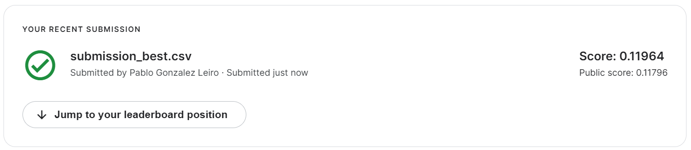

# RossmannChallenge

[Link a la competencia](https://www.kaggle.com/competitions/rossmann-store-sales/)

Las notebooks utilizadas son:
- `1-data-exploration.ipynb`
- `2-data-preprocessing.ipynb`
- `3-durations-preprocessing.ipynb`
- `4-normalize-and-encode.ipynb`
- `5-full-model.ipynb`: acá se desarrolla el modelo de redes neuronales a paritr de los datos preprocesados en las notebooks anteriores. Se explica el concepto de *Entity Embeddings* y la métrica de la competencia. Además se generan gráficos de los *embeddings* que se guardan en la carpeta /embeddings.

En el archivo `requirements.txt` se encuentran las librerías necesarias para correr las notebooks.

El archivo `hiperparametros.xlsx` indica las distintas pruebas que se corrieron y los hiperparámetros utilizados en cada una junto con el score correspondiente.El archivo con el mejor resultado se obtuvo con `submissions/submission-best.csv`.

